# Key Vault queries

This page aims to centralize useful queries for Azure Key Vault.
Queries on the log through Log Analytics can also be configured as alerts if needed.

## 1. Prequisites

In order to be able to perform queries, as for any other Azure resources, diagnostic settings must be configrued on the target Key Vault instance

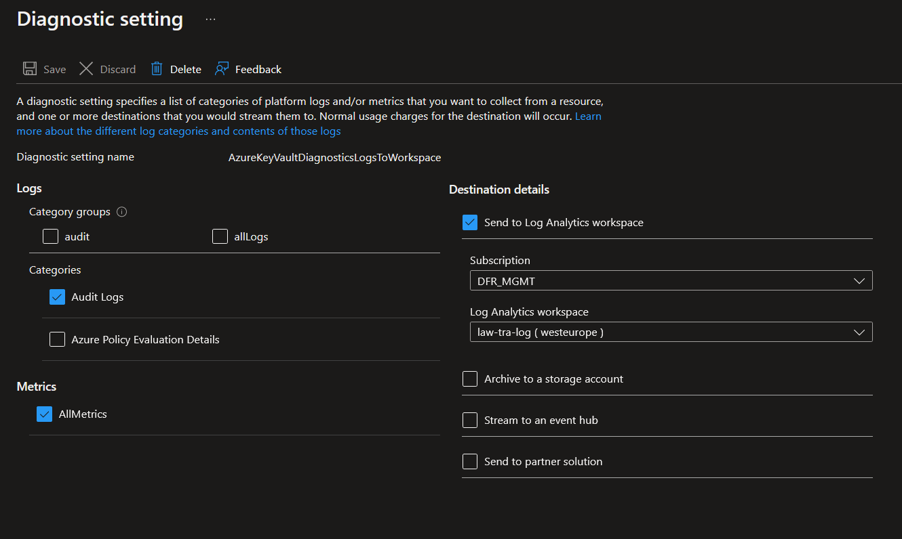  

**Note**: Usually, metrics are not pushed into log analytics. Azure metrics gives access to metrics in near real time while querying tohse samemetrics add lag and additional cost of ingestion on log analytics. In case of DBaaS KeyVault, it may be the case if the diagnostic settings is configured through an Azure Policy.

## 2. Queries

Queries are performed against the log analytics worksapce confired as a target to the diagnostic settings.
The workspace is available directly in the **Monitoring** section of the CosmosDB instance.

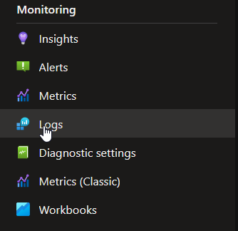

### 2.1. Type of Log category

FIrst step to analyze daignostic logs on Key Vault is to identify the log category.
There is mainly one category that will produce log which is the `AuditEvent`, as is displayed on the previous illustration.
Nevertheless, the following query can be used to identify the `Category` available:

```bash

AzureDiagnostics
| where TimeGenerated >= ago(24h)
| summarize count() by Category

```

As expected, the result shows only logs for `AuditEvent`

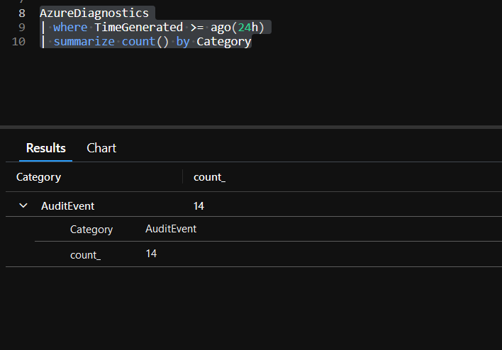

For Azure Metrics exported to log analytics, the query is similar:

```bash

AzureMetrics
| where TimeGenerated >= ago(24h)
| summarize count() by MetricName

```

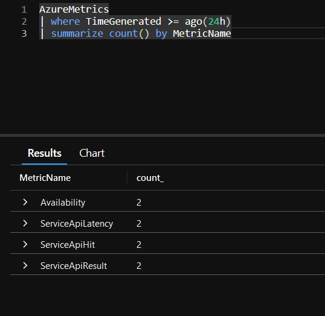

### 2.2. Identify Key Vault caller

Identifying the callers on the Key Vault is done with the below query:

```bash

AzureDiagnostics
| where TimeGenerated >= ago(30m)
| summarize count() by CallerIPAddress
| render barchart 

```

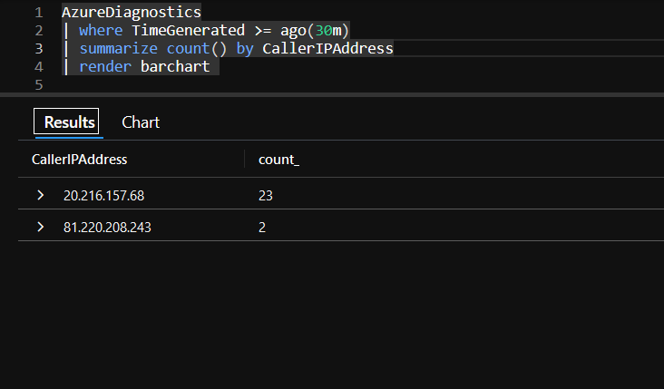  
  
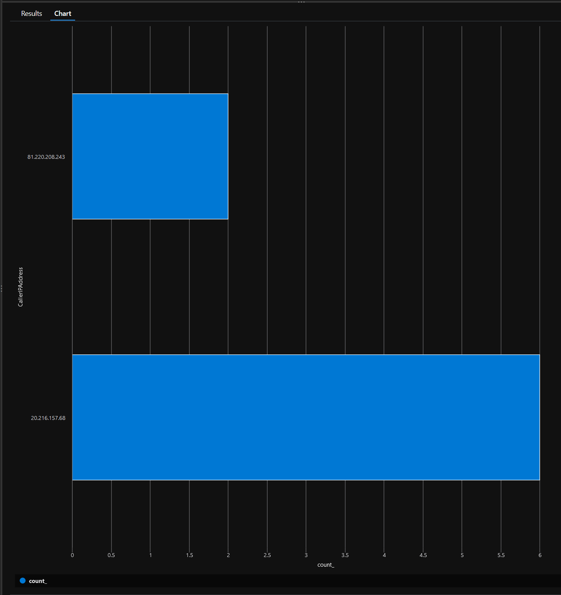  

To add details on the operations, add `OperationName` in the query:

```bash

AzureDiagnostics
| where TimeGenerated >= ago(24h)
| summarize count() by CallerIPAddress,OperationName
| order by OperationName
| render barchart 

```

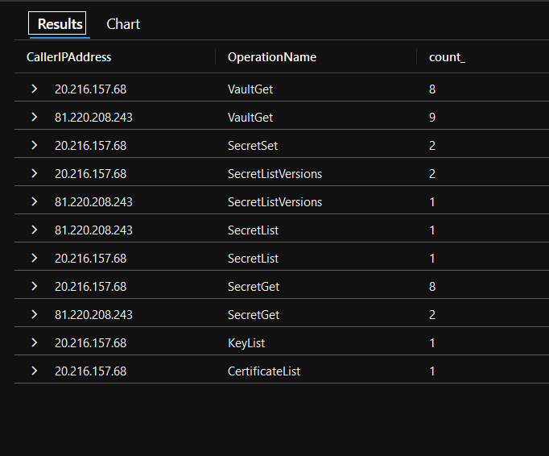  
  
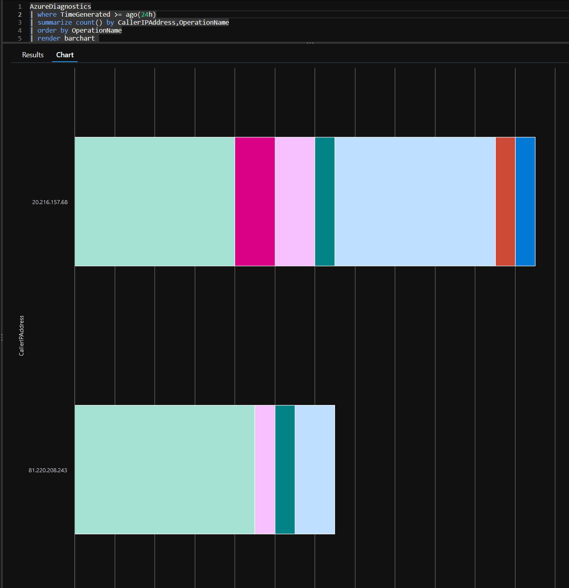  

In needed, it is possible to get details on operations for one caller:

```bash

AzureDiagnostics
| where TimeGenerated >= ago(24h)
| where CallerIPAddress contains "81.220"
| summarize count() by OperationName
| render barchart 

```

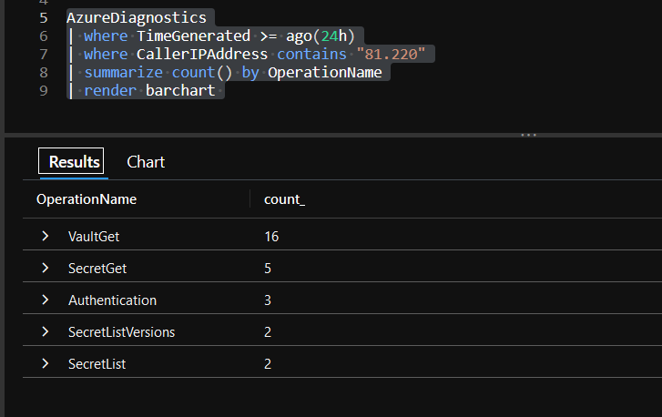  
  
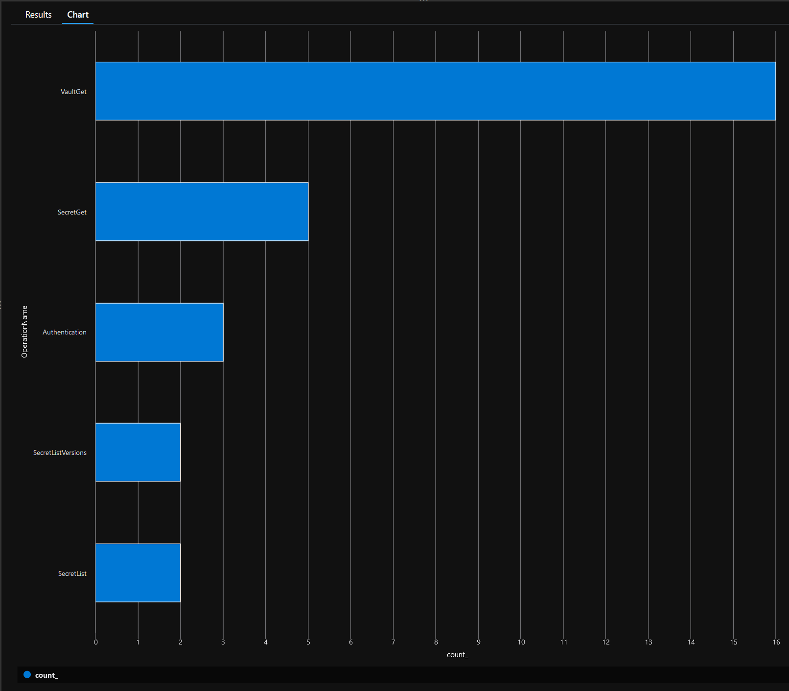  

Information on the client type can also be queried:  

```bash

AzureDiagnostics
| where TimeGenerated >= ago(28d)
| summarize count() by clientInfo_s, CallerIPAddress

```

The Application Id:

```bash

AzureDiagnostics
| where TimeGenerated >= ago(28d)
| summarize count() by CallerIPAddress, identity_claim_appid_g

```

The User principal name:

```bash

AzureDiagnostics
| where TimeGenerated >= ago(28d)
| summarize count() by CallerIPAddress, identity_claim_upn_s, identity_claim_http_schemas_xmlsoap_org_ws_2005_05_identity_claims_upn_s

```

**Note**: there are 2 field that may contain the UPN, the *identity_claim_upn_s* and the *identity_claim_http_schemas_xmlsoap_org_ws_2005_05_identity_claims_upn_s*

### 2.3. Detect failure

Detecting failure on the Key Vault relies on the `httpStatusCode`

```bash

AzureDiagnostics
| where TimeGenerated >= ago(28d)
| where httpStatusCode_d >=400
| project httpStatusCode_d, clientInfo_s, ResultSignature, OperationName, CallerIPAddress, ResultDescription

```

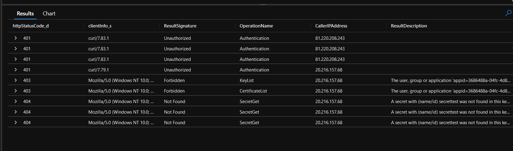  

In order to get authentication information, the following query is available

```bash

AzureDiagnostics
| where TimeGenerated >= ago(28d)
| where httpStatusCode_d >=400
| where OperationName == "Authentication"
| project httpStatusCode_d, clientInfo_s, ResultSignature, OperationName, CallerIPAddress, ResultDescription

```

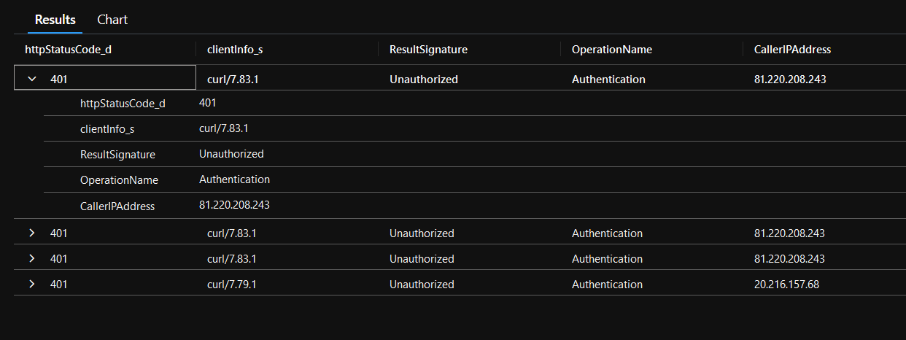  

